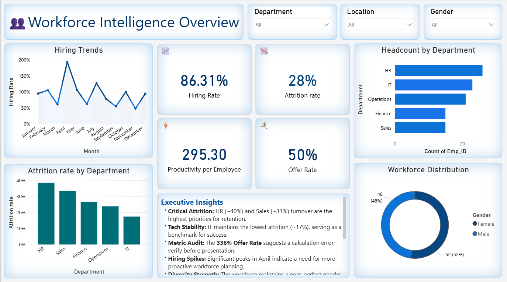

# 📊 Workforce Intelligence Dashboard

## 📌 Overview
This project presents a Workforce Intelligence Dashboard that provides insights into hiring trends, attrition rates, and workforce performance.

## 🚀 Features
- Hiring Trends Analysis
- Attrition Rate Tracking
- Department-wise Insights
- Workforce Distribution

## 📷 Dashboard Preview

## 🛠️ Tools Used
- Power BI
- Data Analysis
- Data Visualization

## 📁 How to Use
1. Download the .pbix file
2. Open in Power BI
3. Explore dashboard insights

## ⭐ Project Purpose
Created to showcase data analytics and visualization skills.
